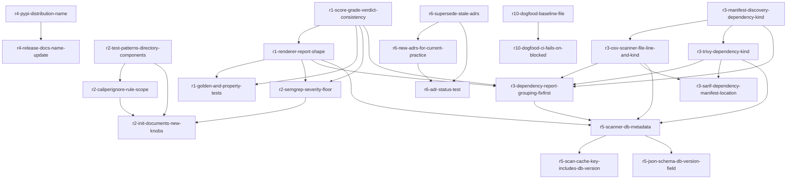

# Implementation Plan (TASKS.md)

## Dependency Graph

## r1-score-grade-verdict-consistency: Fix score/grade consistency and verdict wording in review_summary
R1 AC1/AC2: ensure quality score and maintainability grade are derived from the same source (never 0/100 quality with an A grade), and verdict wording distinguishes 'findings block merge' (uses 'blocked' only when policy rejects) from 'scan incomplete' (lists plugins that did not finish and why: timeout/not installed/crashed).

- **Acceptance Criteria**:
  - build_review_summary() never returns a summary where quality_score == 0 and maintainability_grade == 'A' simultaneously; grade is computed from quality_score via one shared function, or quality_score is omitted when grade is present
  - verdict text contains the word 'blocked' only when the policy verdict is an actual reject (policy_verdict == 'reject')
  - when one or more plugins fail to complete (timeout/not_installed/crashed), review_summary produces a verdict string containing 'incomplete' and a list of (plugin_name, reason) entries
  - ValueError is not raised for a fully-successful scan; the incomplete path is only triggered by actual incomplete PluginResult entries
- **Files**: src/caliper/core/review_summary.py, tests/unit/test_review_summary.py
- **RED Note**: Write pytest tests in tests/unit/test_review_summary.py: (1) build a fake list[PluginResult] that would previously yield quality_score=0 with grade A, assert the returned summary never has that combination; (2) build a summary with no policy reject and assert 'blocked' not in verdict text; (3) build a PluginResult with status=timeout/not_installed/crashed and assert verdict contains 'incomplete' plus the plugin name and reason. These must fail against current review_summary.py behavior.
- **Estimated LOC**: 90

## r1-renderer-report-shape: Renderer: plugin table filtering, path relativization, detector sections, ordering, truncation
R1 AC3-AC7: plugin table lists only ran/errored plugins with a one-line skipped summary; paths shown relative to repo root; CAL-NNN detector and complexity findings get their own sections shaped like semgrep's; findings ordered severity-then-file within a section, sections ordered by highest severity present; report capped at 65536 chars with per-section truncation counts.

- **Acceptance Criteria**:
  - render_markdown() plugin table omits rows for plugins with status='skipped'; a single line 'skipped: <name> (<reason>), ...' appears once summarizing all skipped plugins
  - render_markdown() never emits a path beginning with '/workspace/'; all finding paths are relative to repo_path
  - a detector (rule_id starting 'CAL-') or complexity finding renders in its own section with severity icon, 'file:line', rule id, one-line message, and fix suggestion when metadata['fix'] is present
  - within a section, findings are ordered critical, high, medium, low, info, then alphabetically by file; sections are ordered by the highest severity finding they contain
  - render_markdown() output is truncated to 65536 chars max, and a truncated section states how many findings were omitted, e.g. '(12 more findings omitted)'
- **Files**: src/caliper/core/renderer.py, src/caliper/templates/comment.md.j2, tests/unit/test_renderer.py
- **Depends on**: r1-score-grade-verdict-consistency
- **RED Note**: Add tests to tests/unit/test_renderer.py: (1) render with a skipped PluginResult, assert its name never appears as its own table row but appears in a single 'skipped:' line; (2) render a Finding with file='/workspace/src/foo.py', assert '/workspace' not in output and 'src/foo.py' is; (3) render a Finding with rule_id='CAL-001', assert it appears under a dedicated section header distinct from the semgrep section, with the same icon/file:line/message shape; (4) render findings out of severity order, assert output lists critical before info within a section; (5) render >65536 chars worth of findings, assert len(output) <= 65536 and an '(N more findings omitted)' string appears.
- **Estimated LOC**: 160

## r1-golden-and-property-tests: Golden-file and property-based tests for report ordering/shape
R1 AC8: a golden-file test renders a fixture list[PluginResult] and compares against a committed expected markdown file; a property test (Hypothesis) asserts AC6 ordering holds for arbitrary finding lists.

- **Acceptance Criteria**:
  - tests/unit/test_renderer_golden.py renders a fixed fixture list[PluginResult] via render_markdown() and asserts byte-for-byte equality against a committed tests/fixtures/renderer_golden.md
  - a Hypothesis property test generates arbitrary lists of Finding with random severities/files and asserts render_markdown() output always lists severities in critical>high>medium>low>info order within each section
- **Files**: tests/unit/test_renderer_golden.py, tests/fixtures/renderer_golden.md, tests/unit/test_plugin_properties.py
- **Depends on**: r1-renderer-report-shape, r1-score-grade-verdict-consistency
- **RED Note**: Write the golden test first against the NEW renderer behavior (post r1-renderer-report-shape): construct a small fixed list[PluginResult] fixture, render it, and hand-author the expected tests/fixtures/renderer_golden.md by running the renderer once and inspecting output, then commit it as the golden file (the RED state is 'file does not exist yet / mismatch'). Add a Hypothesis strategy for Finding severity+file and assert ordering invariant.
- **Estimated LOC**: 90

## r2-test-patterns-directory-components: Extend TEST_PATTERNS to match *-tests/*_tests/*-test/*_test directory components
R2 AC1: TEST_PATTERNS additionally matches directory path components like compatibility-tests/, still never matching spec/ or fixtures/, and never false-positive on look-alikes like attest/, latest.ts, contest.py.

- **Acceptance Criteria**:
  - should_ignore('compatibility-tests/foo.py', TEST_PATTERNS) is True
  - should_ignore('pkg/unit_tests/bar.py', TEST_PATTERNS) is True
  - should_ignore('pkg/e2e-test/baz.py', TEST_PATTERNS) is True
  - should_ignore('spec/foo.py', TEST_PATTERNS) is False
  - should_ignore('fixtures/foo.py', TEST_PATTERNS) is False
  - should_ignore('attest/foo.py', TEST_PATTERNS) is False and should_ignore('src/latest.ts', TEST_PATTERNS) is False and should_ignore('src/contest.py', TEST_PATTERNS) is False
- **Files**: src/caliper/core/ignore.py, tests/unit/test_ignore_tests_default.py
- **RED Note**: Add pytest cases to tests/unit/test_ignore_tests_default.py asserting should_ignore matches for '*-tests'/'*_tests'/'*-test'/'*_test' directory components and non-matches for spec/, fixtures/, and the look-alike words attest/latest/contest — must fail against current TEST_PATTERNS.
- **Estimated LOC**: 30

## r2-caliperignore-rule-scope: Parse .caliperignore per-path rule-id scoping syntax into typed RuleScope
R2 AC2: .caliperignore supports '<glob> !<rule-id-or-prefix>' meaning 'under this path, drop findings whose rule id starts with this prefix', parsed into a typed RuleScope in core/ignore.py, applied post-detection pre-policy in the normalizer path; unknown syntax raises ValueError naming the line.

- **Acceptance Criteria**:
  - load_ignore_patterns() parses a line 'compatibility-tests/** !DS-' into a RuleScope(glob='compatibility-tests/**', rule_prefix='DS-')
  - load_ignore_patterns() parses 'tools/docs/** !CAL-002' into RuleScope(glob='tools/docs/**', rule_prefix='CAL-002')
  - a line with '!' but malformed syntax (e.g. missing glob, or '!' with no following text) raises ValueError whose message includes the offending line number
  - core/normalizer.py drops a Finding whose file matches a RuleScope's glob and whose rule_id starts with that scope's rule_prefix, applied after detection and before policy evaluation
- **Files**: src/caliper/core/ignore.py, src/caliper/core/normalizer.py, tests/unit/test_ignore.py
- **Depends on**: r2-test-patterns-directory-components
- **RED Note**: Add tests to tests/unit/test_ignore.py: (1) load_ignore_patterns on a fixture file with a valid RuleScope line, assert parsed RuleScope fields; (2) a malformed line raises ValueError with the line number in the message; (3) a normalizer-level test (or in tests/unit/test_ignore.py) constructs findings under a scoped path with a matching rule prefix and asserts they are dropped, while a non-matching rule id survives. Sequenced after r2-test-patterns-directory-components since both edit core/ignore.py.
- **Estimated LOC**: 90

## r2-semgrep-severity-floor: Default semgrep severity floor excludes sub-medium findings from verdict/scores
R2 AC3: findings below 'medium' from semgrep do not count toward verdict/scores and render in a collapsed 'notes' section; configurable via .caliper.yaml thresholds.semgrep.min_severity (default medium).

- **Acceptance Criteria**:
  - repo_config parses thresholds.semgrep.min_severity from .caliper.yaml, defaulting to 'medium' when absent
  - a semgrep Finding with severity='low' or 'info' is excluded from verdict/score computation in review_summary.py when below the configured floor
  - such below-floor semgrep findings are still returned and rendered by renderer.py inside a collapsed 'notes' section, not in the main findings sections
  - setting thresholds.semgrep.min_severity: 'low' in .caliper.yaml causes 'low' severity semgrep findings to count toward verdict/scores again
- **Files**: src/caliper/core/repo_config.py, src/caliper/core/review_summary.py, src/caliper/core/renderer.py, tests/unit/test_repo_config.py
- **Depends on**: r1-renderer-report-shape, r1-score-grade-verdict-consistency
- **RED Note**: Add tests: (1) tests/unit/test_repo_config.py asserts thresholds.semgrep.min_severity defaults to 'medium' and is overridable; (2) a review_summary test with a low-severity semgrep finding asserts it does not affect the computed verdict/score; (3) a renderer test asserts the low-severity finding appears in a collapsed 'notes' section, not the main section. Depends on the r1 renderer/summary lanes since it edits the same files they created.
- **Estimated LOC**: 80

## r2-init-documents-new-knobs: caliper init documents .caliperignore rule-scope and severity-floor knobs
R2 AC4: caliper init's standard config comments document both the .caliperignore per-path rule-scope syntax and thresholds.semgrep.min_severity.

- **Acceptance Criteria**:
  - the config template/comments written by 'caliper init' (cli/init_cmd.py) include a commented example of the '<glob> !<rule-id-prefix>' .caliperignore syntax
  - the config template written by 'caliper init' includes a commented thresholds.semgrep.min_severity example with its default value 'medium'
- **Files**: src/caliper/cli/init_cmd.py, tests/unit/test_init_cmd.py
- **Depends on**: r2-caliperignore-rule-scope, r2-semgrep-severity-floor, r2-test-patterns-directory-components
- **RED Note**: Add a test in tests/unit/test_init_cmd.py that runs the init command against a tmp dir and asserts the generated .caliper.yaml (or equivalent) text contains both 'thresholds' + 'min_severity' and an example '!' rule-scope line in its comments.
- **Estimated LOC**: 30

## r3-manifest-discovery-dependency-kind: Deterministic direct/transitive dependency_kind classification in manifest_discovery
R3 AC2: add a function to manifest_discovery.py that determines dependency_kind (direct/transitive/unknown) for a package name from the manifest that declares it, across pyproject/requirements/package.json/pom.xml/go.mod/Cargo.toml.

- **Acceptance Criteria**:
  - classify_dependency_kind(repo_path, package_name, manifest_path) returns 'direct' when the package is a top-level dependency declared in the given manifest
  - classify_dependency_kind returns 'transitive' when the package is not declared directly in any discovered manifest but appears in a lockfile
  - classify_dependency_kind returns 'unknown' when no manifest/lockfile evidence exists for the package
  - the function works across pyproject.toml, requirements*.txt, package.json, pom.xml, go.mod, and Cargo.toml fixtures
- **Files**: src/caliper/core/manifest_discovery.py, tests/unit/test_manifest_discovery.py
- **RED Note**: Add fixture manifests per ecosystem to tests/unit/test_manifest_discovery.py (or a fixtures dir it reads) and assert classify_dependency_kind returns 'direct' for a top-level dep, 'transitive' for a lockfile-only dep, and 'unknown' for an unlisted package name, across all six manifest formats.
- **Estimated LOC**: 120

## r3-osv-scanner-file-line-and-kind: osv-scanner findings carry file/line from source.path and dependency_kind metadata
R3 AC1 (issue #484) and AC2: every osv-scanner finding's file is the lockfile/manifest path relative to repo root from results[].source.path, line when present, and metadata.dependency_kind is set via manifest_discovery.

- **Acceptance Criteria**:
  - parsing an osv-scanner JSON result with results[0].source.path='requirements.txt' produces a Finding with file='requirements.txt' (relative, no leading /workspace)
  - when the OSV result includes a line number for the vulnerable line, Finding.line is set to that value; otherwise Finding.line is None
  - every osv-scanner Finding has metadata['dependency_kind'] in {'direct','transitive','unknown'}, computed by calling manifest_discovery.classify_dependency_kind
- **Files**: src/caliper/plugins/osv_scanner.py, tests/unit/test_osv_plugin.py
- **Depends on**: r3-manifest-discovery-dependency-kind
- **RED Note**: Add a test to tests/unit/test_osv_plugin.py that feeds a fixture osv-scanner JSON payload with results[].source.path set, and asserts the resulting Finding.file is the relative manifest path, Finding.line matches when present, and Finding.metadata['dependency_kind'] is one of direct/transitive/unknown.
- **Estimated LOC**: 90

## r3-trivy-dependency-kind: trivy findings carry dependency_kind metadata
R3 AC2: trivy findings carry metadata.dependency_kind determined via manifest_discovery, mirroring the osv-scanner behavior.

- **Acceptance Criteria**:
  - every trivy Finding produced from a dependency-vulnerability result has metadata['dependency_kind'] in {'direct','transitive','unknown'}, computed via manifest_discovery.classify_dependency_kind
- **Files**: src/caliper/plugins/trivy.py, tests/unit/test_trivy_plugin.py
- **Depends on**: r3-manifest-discovery-dependency-kind
- **RED Note**: Add a test to tests/unit/test_trivy_plugin.py feeding a fixture trivy JSON output for a known package and asserting the resulting Finding.metadata['dependency_kind'] is set correctly (direct vs transitive per fixture).
- **Estimated LOC**: 50

## r3-dependency-report-grouping-fixfirst: Dependency report section: group by advisory, show installed->fixed, and fix-first list
R3 AC3: the report's dependency section groups findings by advisory, shows package installed -> fixed, the declaring manifest, and direct/transitive, and ends with a deterministic fix-first list of minimal direct bumps that clear every critical/high finding.

- **Acceptance Criteria**:
  - render_markdown() dependency section groups findings sharing the same advisory id under one heading, showing '<package> <installed> -> <fixed>', the declaring manifest path, and 'direct'/'transitive'
  - a deterministic compute_fix_first(findings) function returns the minimal set of direct package bumps that clears every critical/high finding, given fixed-version data
  - when a critical/high finding is transitive-only and its direct parent can be resolved, the fix-first list names the direct parent package instead
  - when a transitive-only finding's direct parent cannot be resolved, the fix-first list entry reads 'transitive: needs `<tool> dependency tree`'
- **Files**: src/caliper/core/renderer.py, src/caliper/templates/comment.md.j2, tests/unit/test_renderer.py
- **Depends on**: r3-osv-scanner-file-line-and-kind, r3-trivy-dependency-kind, r1-renderer-report-shape, r1-score-grade-verdict-consistency, r3-manifest-discovery-dependency-kind
- **RED Note**: Add tests to tests/unit/test_renderer.py: (1) render two findings sharing an advisory id and assert they appear grouped under one heading with 'installed -> fixed' text and manifest/direct-transitive labels; (2) call compute_fix_first with a mix of direct-critical and transitive-critical findings and assert the returned list has the minimal direct-bump set; (3) assert a transitive-only unresolved case renders the 'needs `<tool> dependency tree`' fallback string.
- **Estimated LOC**: 130

## r3-sarif-dependency-manifest-location: SARIF places dependency findings on manifest file/line
R3 AC4: SARIF output places dependency (osv-scanner/trivy) findings on the manifest file/line so they appear inline in PR review.

- **Acceptance Criteria**:
  - to_sarif() for a dependency Finding (osv-scanner or trivy origin) emits a physicalLocation.artifactLocation.uri equal to the manifest path and a region.startLine equal to the finding's line (or 1 when line is None)
  - existing non-dependency findings (semgrep/detectors) keep their current SARIF location behavior unchanged
- **Files**: src/caliper/core/sarif.py, tests/unit/test_sarif.py
- **Depends on**: r3-osv-scanner-file-line-and-kind, r3-trivy-dependency-kind
- **RED Note**: Add a test to tests/unit/test_sarif.py: build a dependency Finding with file='requirements.txt', line=5, call to_sarif(), and assert the resulting SARIF result's physicalLocation points at requirements.txt line 5. Add a control-case test asserting a semgrep finding's location is unaffected.
- **Estimated LOC**: 50

## r4-pypi-distribution-name: Rename PyPI distribution to caliper-review, keep import package/console script as caliper
R4 AC1/AC3: pyproject.toml [project] name changes from 'caliper' to 'caliper-review'; uv.lock regenerated; a test asserts the built wheel's distribution name != 'caliper' and the console script is still 'caliper'.

- **Acceptance Criteria**:
  - pyproject.toml [project].name == 'caliper-review'
  - pyproject.toml [project.scripts] still maps 'caliper' to its entry point (import package name unchanged)
  - a test builds/inspects the wheel metadata (or parses pyproject.toml directly) and asserts the distribution name != 'caliper' while the console_scripts entry 'caliper' still exists
  - uv.lock is regenerated and its top-level package name matches 'caliper-review'
- **Files**: pyproject.toml, uv.lock, tests/unit/test_pyproject_distribution_name.py
- **RED Note**: Write tests/unit/test_pyproject_distribution_name.py: parse pyproject.toml (tomllib) and assert project.name == 'caliper-review' and project.scripts['caliper'] is present; this must fail against the current name 'caliper'. Regenerate uv.lock with `uv lock` after the pyproject change, in the GREEN step.
- **Estimated LOC**: 30

## r4-release-docs-name-update: Update release-please workflow and docs for the new PyPI distribution name
R4 AC2: release-please.yml publish job's environment URL and docs/CAPABILITIES.md/README install instructions reference the new distribution name.

- **Acceptance Criteria**:
  - release-please.yml's publish job environment.url references 'caliper-review' instead of 'caliper'
  - README.md install instructions (pip install ...) reference 'caliper-review'
  - docs/CAPABILITIES.md install instructions reference 'caliper-review'
  - README documents that the PyPI trusted publisher must be registered by the owner for repo gitrdunhq/caliper, workflow release-please.yml, environment pypi
- **Files**: .github/workflows/release-please.yml, docs/CAPABILITIES.md, README.md
- **Depends on**: r4-pypi-distribution-name
- **RED Note**: This is a docs/workflow-text change with no direct pytest coverage; add a lightweight test (e.g. extend tests/unit/test_pyproject_distribution_name.py or a new tests/unit/test_release_docs_reference_name.py) asserting release-please.yml's environment.url and README.md both contain the string 'caliper-review'. Must fail before the edit since those files currently say 'caliper'.
- **Estimated LOC**: 20

## r5-scanner-db-metadata: trivy/osv-scanner findings carry db_version/db_updated_at metadata
R5 AC1: trivy and osv-scanner results carry metadata.db_version/db_updated_at from the scanner's own output or DB metadata file; the report prints one 'vulnerability data as of <timestamp>' line per scanner.

- **Acceptance Criteria**:
  - every trivy Finding has metadata['db_updated_at'] set from trivy's DB metadata output (ISO8601 string) when available, else None
  - every osv-scanner Finding has metadata['db_updated_at'] set from the OSV DB/output timestamp when available, else None
  - render_markdown() prints one 'vulnerability data as of <timestamp>' line per scanner that reported a db_updated_at
- **Files**: src/caliper/plugins/trivy.py, src/caliper/plugins/osv_scanner.py, src/caliper/core/renderer.py, tests/unit/test_trivy_plugin.py
- **Depends on**: r3-osv-scanner-file-line-and-kind, r3-trivy-dependency-kind, r3-dependency-report-grouping-fixfirst, r1-renderer-report-shape
- **RED Note**: Add tests to tests/unit/test_trivy_plugin.py (and a matching case in tests/unit/test_osv_plugin.py if that file needs edits — check first) asserting metadata['db_version']/['db_updated_at'] is populated from a fixture DB-metadata payload; add a renderer test asserting the 'vulnerability data as of <timestamp>' line appears once per scanner with that metadata present. Sequenced after the R3 plugin lanes since it edits the same plugin files.
- **Estimated LOC**: 90

## r5-scan-cache-key-includes-db-version: Scan cache key incorporates live-DB scanner db_updated_at
R5 AC2: the scan cache key includes each live-DB scanner's db_updated_at so a newer DB never serves a stale cached verdict; test proves changed timestamp changes the key and unchanged does not.

- **Acceptance Criteria**:
  - compute_scan_cache_key(..., db_versions={'trivy': '2026-01-01T00:00:00Z', 'osv-scanner': '2026-01-01T00:00:00Z'}) differs from the same call with a different trivy db_updated_at value
  - compute_scan_cache_key(...) called twice with identical db_versions produces an identical key
- **Files**: src/caliper/core/scan_cache_key.py, tests/unit/test_scan_cache_key.py
- **Depends on**: r5-scanner-db-metadata
- **RED Note**: Add tests to tests/unit/test_scan_cache_key.py: call the key function twice with only db_updated_at differing and assert the keys differ; call it twice with identical inputs and assert the keys are equal. Must fail against current signature that doesn't accept db version info.
- **Estimated LOC**: 30

## r5-json-schema-db-version-field: JSON report schema gains optional db_version/db_updated_at field
R5 AC3: JSON report schema (docs/schema/report-v1.0.json) gains the optional db_version/db_updated_at field; schema test updated.

- **Acceptance Criteria**:
  - docs/schema/report-v1.0.json defines an optional 'db_updated_at' (and 'db_version') property on the finding/scanner metadata schema, not required
  - core/json_report.py serializes metadata.db_version/db_updated_at into the JSON report output when present
  - a JSON report with no db_updated_at metadata still validates against the updated schema (field remains optional)
- **Files**: src/caliper/core/json_report.py, docs/schema/report-v1.0.json, tests/unit/test_report_schema.py
- **Depends on**: r5-scanner-db-metadata
- **RED Note**: Add a test to tests/unit/test_report_schema.py that builds a report with a Finding carrying metadata.db_updated_at, serializes via json_report, validates it against docs/schema/report-v1.0.json, and asserts the field round-trips; also assert a report without that metadata still validates.
- **Estimated LOC**: 40

## r6-supersede-stale-adrs: Mark ADRs 001/002/003/004/008 Superseded with decommission-log pointers
R6 AC1: ADRs 001, 002, 003, 004, 008 get status Superseded with a dated pointer to the relevant docs/decommission-log.md entry.

- **Acceptance Criteria**:
  - docs/adr/001*.md, 002*.md, 003*.md, 004*.md, 008*.md each have '## Status' set to 'Superseded' with a dated line pointing to a specific docs/decommission-log.md entry
- **Files**: docs/adr/001-record-architecture-decisions.md, docs/decommission-log.md
- **RED Note**: This is a documentation-only change (no pytest RED possible for prose content itself); rely on r6-adr-status-test (a separate lane) to assert the Status field programmatically. In this lane, edit each of the five ADR files' Status section directly and add/verify a corresponding entry exists in docs/decommission-log.md. NOTE: files list only shows one ADR path plus the log due to the 5-file task cap — the implementer must locate and edit all five ADR files (001,002,003,004,008) under docs/adr/ by their actual filenames.
- **Estimated LOC**: 40

## r6-new-adrs-for-current-practice: Add new ADRs documenting semgrep pinning, test-exclusion default, severity vocabulary, tag-then-drop decommissioning
R6 AC2: new ADRs (next free numbers) documenting: semgrep rules pinned to a local snapshot never the registry; test code excluded by default; one severity vocabulary at the plugin boundary (ERROR->high); tag-then-drop decommissioning with the log as the record.

- **Acceptance Criteria**:
  - a new ADR file exists documenting semgrep rules pinned to a local snapshot, with '## Status' = 'Accepted'
  - a new ADR file exists documenting test code excluded by default, with '## Status' = 'Accepted'
  - a new ADR file exists documenting the single severity vocabulary at the plugin boundary (ERROR->high), with '## Status' = 'Accepted'
  - a new ADR file exists documenting tag-then-drop decommissioning with the decommission log as the record, with '## Status' = 'Accepted'
  - each new ADR uses the next free sequential number after the highest existing ADR number
- **Files**: docs/adr/011-semgrep-rules-pinned-snapshot.md, docs/adr/012-test-code-excluded-by-default.md, docs/adr/013-single-severity-vocabulary.md, docs/adr/014-tag-then-drop-decommissioning.md
- **Depends on**: r6-supersede-stale-adrs
- **RED Note**: Documentation-only lane; verified by r6-adr-status-test. Confirm the actual highest existing ADR number in docs/adr/ before naming files 011-014 (renumber if a higher ADR already exists).
- **Estimated LOC**: 60

## r6-adr-status-test: Test that every ADR has a valid Status and no Accepted ADR references a dead module path
R6 AC3: a test asserts every ADR has a ## Status of Accepted/Superseded/Proposed and that no Accepted ADR references a module path that no longer exists in src/caliper/.

- **Acceptance Criteria**:
  - test_adr_status parses every file in docs/adr/*.md and asserts each has a '## Status' section with value in {Accepted, Superseded, Proposed}
  - for every ADR whose Status is Accepted, any backtick-quoted path under src/caliper/ referenced in its body actually exists on disk; the test lists the offending ADR filename and path on failure
- **Files**: tests/unit/test_adr_status.py
- **Depends on**: r6-supersede-stale-adrs, r6-new-adrs-for-current-practice
- **RED Note**: Write tests/unit/test_adr_status.py to glob docs/adr/*.md, regex-extract '## Status' value and assert membership in the allowed set, and regex-extract backtick paths starting with 'src/caliper/' asserting Path(path).exists() for every Accepted ADR. Run against current repo first (RED) — expect failures on ADRs not yet updated by the two docs lanes above; this test should only pass once both docs lanes have landed.
- **Estimated LOC**: 50

## r7-ci-host-tests-policy: Move contract/e2e CI jobs into the test-image container instead of CALIPER_ALLOW_HOST_TESTS
R7 AC1/AC2: foreman.yml and release-candidate.yml's contract/e2e jobs run inside scripts/build-test.sh's image instead of setting CALIPER_ALLOW_HOST_TESTS; a test asserts no workflow sets that env var (or only a stated sanctioned exception does).

- **Acceptance Criteria**:
  - foreman.yml no longer sets CALIPER_ALLOW_HOST_TESTS=1 in its contract/e2e jobs; those jobs instead build/run via scripts/build-test.sh
  - release-candidate.yml no longer sets CALIPER_ALLOW_HOST_TESTS="1"; that job instead runs via scripts/build-test.sh
  - test_github_actions_policy.py fails if any .github/workflows/*.yml file sets CALIPER_ALLOW_HOST_TESTS unless it is on an explicit sanctioned-jobs allowlist defined in the test itself
- **Files**: .github/workflows/foreman.yml, .github/workflows/release-candidate.yml, tests/unit/test_github_actions_policy.py
- **RED Note**: Write tests/unit/test_github_actions_policy.py to grep every .github/workflows/*.yml for 'CALIPER_ALLOW_HOST_TESTS' and assert zero matches (or only the sanctioned allowlist names it explicitly). Run first against current workflows to confirm it fails (3 occurrences in foreman.yml, 1 in release-candidate.yml), then edit the workflows to use scripts/build-test.sh instead.
- **Estimated LOC**: 60

## r8-container-runner-flag: caliper review --runner auto|container|native
R8 AC1-AC4: add --runner flag to 'caliper review' (default auto), which uses the container when podman/docker is on PATH and the caliper image is present/pullable, else native with a one-line stderr notice; container mode mounts repo read-only at /workspace, .temp read-write, forwards CALIPER_* env vars and CLI args verbatim, runs as image's non-root user, returns container's exit code/stdout unchanged; 'caliper part' always runs native.

- **Acceptance Criteria**:
  - 'caliper review --runner auto' with a fake ToolRunnerPort reporting podman present and image pullable invokes the container path; with neither engine on PATH it falls back to native and prints a one-line stderr notice
  - 'caliper review --runner container' invocation assembles a run command mounting repo_path read-only at /workspace and .temp read-write, forwarding every CALIPER_* env var present in the process environment and the CLI args verbatim
  - the container invocation runs as the image's non-root user and the CLI returns the container process's exit code and stdout unchanged (via the fake ToolRunnerPort)
  - 'caliper part' does not accept or is unaffected by --runner and always executes natively
  - all of the above are tested through a fake ToolRunnerPort; no test spawns a real container
- **Files**: src/caliper/cli/main.py, src/caliper/cli/review_cmd.py, src/caliper/composition/bootstrap.py, tests/unit/test_review_cmd.py
- **RED Note**: Add tests to tests/unit/test_review_cmd.py using a fake/in-memory ToolRunnerPort that records invocations: (1) assert --runner auto picks container when the fake reports podman+image present, and native (with a stderr notice) when neither is present; (2) assert the assembled container command includes the expected mount flags and forwards CALIPER_*-prefixed env vars and the original args; (3) assert the fake's recorded exit code/stdout pass through unchanged to the CLI result; (4) assert 'caliper part' invocation never goes through the container runner path.
- **Estimated LOC**: 150

## r9-install-scanners-pins-win-over-path: install-scanners installs into --bin-dir even when a same-named binary exists on PATH
R9 AC1/AC2: caliper install-scanners installs into --bin-dir even when a same-named binary exists elsewhere on PATH, unless --skip-present is passed; plan reports 'present elsewhere: <path> (version mismatch unknown)' for such tools; path_hint tells the user the bin dir must precede the other PATH location.

- **Acceptance Criteria**:
  - install-scanners with a fake PATH containing an existing 'trivy' binary elsewhere still installs trivy into --bin-dir by default (no --skip-present)
  - install-scanners --skip-present with the same fake PATH skips installing trivy and the plan output notes it was skipped because present elsewhere
  - the plan output for a tool found elsewhere on PATH (without --skip-present) includes the exact string 'present elsewhere: <path> (version mismatch unknown)'
  - the plan/output includes a path_hint telling the user --bin-dir must precede the other PATH location
- **Files**: src/caliper/cli/install_cmd.py, tests/unit/test_install_cmd.py
- **RED Note**: Add tests to tests/unit/test_install_cmd.py: mock PATH lookup (e.g. monkeypatch shutil.which) to report an existing 'trivy' binary elsewhere; assert default behavior still writes into --bin-dir and the plan text contains 'present elsewhere: <path> (version mismatch unknown)' and a path_hint string; assert --skip-present changes behavior to skip installation for that tool.
- **Estimated LOC**: 70

## r10-dogfood-baseline-file: Create .caliper-baseline.yaml so dogfood verdict is not blocked, with expiry test
R10 AC1/AC3: every currently-blocking finding on caliper itself is fixed or baselined in .caliper-baseline.yaml with a --reason and TTL via caliper baseline update; a unit test asserts the baseline file parses and no entry is expired relative to a pinned 'as of' date.

- **Acceptance Criteria**:
  - a .caliper-baseline.yaml file exists at repo root with an entry per currently-blocking finding, each carrying a reason and an expiry/TTL date
  - test_baseline_dogfood.py parses .caliper-baseline.yaml via the existing baseline loader (core/baseline.py) and asserts it parses without error
  - test_baseline_dogfood.py asserts, using a pinned 'as of' datetime fixture (not datetime.now()), that no entry's expiry is before that pinned date
- **Files**: .caliper-baseline.yaml, tests/unit/test_baseline_dogfood.py
- **RED Note**: Write tests/unit/test_baseline_dogfood.py to load .caliper-baseline.yaml (which does not exist yet -> RED: file-not-found or empty-baseline assertion fails) via core/baseline.py's loader, and assert with a pinned 'as of' datetime that every entry has a reason and an unexpired TTL. Then run `caliper review` locally to enumerate current blocking findings and populate .caliper-baseline.yaml with `caliper baseline update --reason ... ` entries (or hand-author matching its schema) to make the GREEN pass.
- **Estimated LOC**: 60

## r10-dogfood-ci-fails-on-blocked: dogfood.yml fails the job on blocked/incomplete verdict
R10 AC2: dogfood.yml fails the job when the verdict is blocked or incomplete (previously it only uploaded SARIF).

- **Acceptance Criteria**:
  - .github/workflows/dogfood.yml's review step has its exit code checked; the job fails (non-zero) when caliper review's verdict is 'blocked' or 'incomplete'
  - scripts/dogfood.sh (if it wraps the review invocation) propagates a non-zero exit code for blocked/incomplete verdicts instead of always exiting 0
- **Files**: .github/workflows/dogfood.yml, scripts/dogfood.sh
- **Depends on**: r10-dogfood-baseline-file
- **RED Note**: This is a CI workflow/shell-script change without a natural pytest RED; verify by running scripts/dogfood.sh locally against the repo (with the new baseline from r10-dogfood-baseline-file in place) and confirming it exits 0 now, then confirm removing the baseline entries locally makes it exit non-zero, proving the fail-on-blocked wiring actually works. Sequenced after r10-dogfood-baseline-file so CI does not immediately start failing on pre-existing blocking findings.
- **Estimated LOC**: 30
