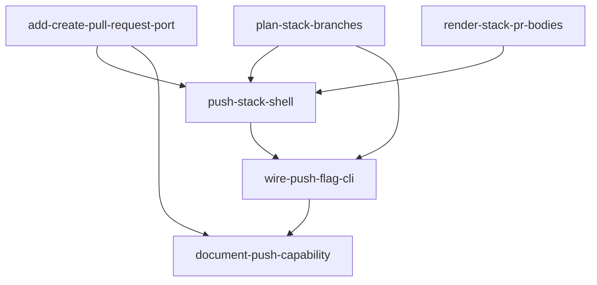

# Implementation Plan (TASKS.md)

## Dependency Graph

## add-create-pull-request-port: Add create_pull_request to PullRequestPublisherPort + GitHubPublisher + NullPublisher
R1. Extend the runtime_checkable PullRequestPublisherPort protocol with a PR-creation method, implement it in the gh-CLI adapter (returning the created PR URL or None), and give NullPublisher a deterministic fake URL. Because the protocol is runtime_checkable and asserted with isinstance() in several places, every existing fake publisher asserted against it must gain the method too.

- **Acceptance Criteria**:
  - caliper.core.ports.PullRequestPublisherPort declares create_pull_request(self, repo: str, head: str, base: str, title: str, body: str) -> str | None (hasattr(PullRequestPublisherPort, 'create_pull_request') is True)
  - GitHubPublisher.create_pull_request('o/r', 'feat-b', 'main', 'T', 'B') shells out through the existing _env()/_scrub_token machinery to ['gh','pr','create','--repo','o/r','--head','feat-b','--base','main','--title','T','--body','B'] with timeout=30
  - GitHubPublisher.create_pull_request returns the created PR URL parsed from stdout (e.g. 'https://github.com/o/r/pull/7' from stdout 'https://github.com/o/r/pull/7\n') when returncode == 0
  - GitHubPublisher.create_pull_request returns None when returncode != 0, when subprocess raises, and when stdout contains no parseable https://.../pull/<n> URL (fail closed, matching the fail-soft convention of post_comment)
  - NullPublisher.create_pull_request('o/r','h','b','t','y') returns a deterministic non-None fake URL, and the same inputs always return the same string
  - isinstance(GitHubPublisher(), PullRequestPublisherPort) and isinstance(NullPublisher(), PullRequestPublisherPort) both remain True (the module-level assert in github_publisher.py still passes)
  - The existing FakePublisher/partial-publisher classes in tests/unit/test_ports.py are updated so the isinstance-satisfies cases still pass and the deliberately-partial negative case still fails isinstance
- **Files**: src/caliper/core/ports.py, src/caliper/adapters/github_publisher.py, tests/unit/test_ports.py, tests/unit/test_publisher_create_pr.py
- **RED Note**: pytest. New test file tests/unit/test_publisher_create_pr.py must prove: (a) PullRequestPublisherPort declares create_pull_request; (b) GitHubPublisher.create_pull_request builds the exact gh argv (monkeypatch subprocess.run, capture cmd) and returns the URL from stdout; (c) it returns None on non-zero exit, on raised exception, and on unparseable stdout; (d) NullPublisher.create_pull_request returns a stable fake URL. Also touch tests/unit/test_ports.py: adding a member to a runtime_checkable Protocol breaks the existing in-file FakePublisher isinstance assertions, so the RED test must show that breakage is anticipated and the fakes gain create_pull_request. Do NOT claim tests/unit/test_github_publisher.py, test_port_registries.py, or test_bootstrap_wiring.py — other suites read them; keep them passing without editing.
- **Estimated LOC**: 80

## plan-stack-branches: Pure stack plan: local refs, deterministic remote branch names, chained bases
R2. New functional-core module src/caliper/core/part_stack.py computing, from an already-cut CutList, the ordered list of stack entries the imperative shell will push. Each entry carries BOTH the local ref the generated restack.sh actually created (caliper-part-<i>) and the deterministic remote branch name derived from PR number + index + bucket. No IO, no wall-clock, no randomness.

- **Acceptance Criteria**:
  - plan_stack(cut: CutList, *, pr_number: int, base_branch: str) -> list[StackEntry] lives in src/caliper/core/part_stack.py
  - StackEntry exposes index (1-based), local_ref, remote_branch, base_branch, and part (the CutList Part)
  - entries[i].local_ref == f'caliper-part-{i+1}' for every i (matches the refs core/part_script.render_restack_script emits under target 'stack')
  - entries[0].base_branch == the base_branch argument (the PR's original base)
  - entries[n].base_branch == entries[n-1].remote_branch for every n > 0
  - remote_branch names are unique across the stack, contain the pr_number, the 1-based index, and the part's bucket value (e.g. 'caliper-pr524-01-documentation'), and are valid git ref names (no spaces, no '..', no leading/trailing '/', no '~^:?*[')
  - plan_stack is deterministic: calling it twice with the same CutList + pr_number + base_branch returns equal entry lists (same remote_branch strings)
  - plan_stack(cut_with_zero_parts, pr_number=1, base_branch='main') raises ValueError
  - Hypothesis property test: for any CutList with 1..N parts, len(plan_stack(...)) == len(cut.parts), entry k's part is cut.parts[k] (cut order preserved), and the set of remote_branch values has size len(cut.parts)
- **Files**: src/caliper/core/part_stack.py, tests/unit/test_part_stack.py
- **RED Note**: pytest + hypothesis (the repo already uses property tests; group them in a TestProperties class per CLAUDE.md, domain Determinism/INVARIANT and Uniqueness/INVARIANT). The failing test must call plan_stack directly with a hand-built CutList and assert on local_ref values, the chaining of base_branch, ref-name validity, uniqueness, and repeat-call equality. ARCHITECTURE: core/part_stack.py is in the core tier — it may import only core + kernel (core/models.py is fine); it must NOT import anything under cli/, adapters/, data/, or plugins/, and it needs a '# tested-by: tests/unit/test_part_stack.py' comment or the drift guard fails.
- **Estimated LOC**: 90

## render-stack-pr-bodies: Render per-part PR body and the stack-linking comment body
R3 AC3 + R5 AC2. Extend cli/part_comment.py (pure rendering, no IO) with a single-part PR body that links the original PR and states stack position, and a linking-comment body that lists the opened stack PR URLs in bottom-of-stack-first order.

- **Acceptance Criteria**:
  - render_stack_pr_body(part, *, index: int, total: int, slug: str, pr_num: int) -> str returns markdown containing the literal substring 'part {index} of {total}'
  - render_stack_pr_body's output contains a link to the original PR ('https://github.com/{slug}/pull/{pr_num}') and names the part's bucket value and its file count
  - render_stack_pr_body lists the part's files (capped, with a '...N more' line when the part exceeds the cap) and never contains restack/jj instructions
  - render_stack_link_comment(urls: list[str], *, slug: str, pr_num: int) -> str returns markdown listing every URL in the given order, numbered 1..len(urls), with the first URL appearing before the second in the output string
  - render_stack_link_comment states the original PR is left open and untouched
  - render_stack_link_comment([]) raises ValueError (the comment is only ever posted for a fully-opened stack)
  - Both functions are pure: same inputs -> byte-identical output, no filesystem or network access
  - The existing render_part_comment behaviour is unchanged
- **Files**: src/caliper/cli/part_comment.py, tests/unit/test_part_stack_comment.py
- **RED Note**: pytest. New test file tests/unit/test_part_stack_comment.py only — do NOT claim tests/unit/test_part_comment.py (it guards render_part_comment and stays untouched). The failing test must build a Part/CutList fixture, call render_stack_pr_body and render_stack_link_comment, and assert on exact substrings ('part 2 of 4', the original-PR URL, ordered URL positions) and on the ValueError for the empty-URL case.
- **Estimated LOC**: 90

## push-stack-shell: Imperative shell: materialize, push each part, open chained PRs, post link comment
R3 + R5. New module src/caliper/cli/part_push.py. Runs the already-generated restack.sh through ToolRunnerPort to materialize the caliper-part-* refs (reusing the sidecar's exact invocation shape — no third branch-manipulation code path), then for each StackEntry in order verifies the local ref exists, pushes it to the remote under its deterministic remote_branch, and opens a PR via the publisher's create_pull_request. Stops at the first failure; posts the linking comment only on full success.

- **Acceptance Criteria**:
  - materialize_parts(restack_path: str, repo_path: Path, runner: ToolRunnerPort) -> bool runs ToolInvocation(cmd=['bash', <absolute resolved restack_path>], cwd=str(repo_path), timeout=300) and returns exit_code == 0 (path resolved to absolute first, because a relative --out is rooted at the invocation cwd, not repo_path)
  - push_stack(entries, *, repo_path, slug, pr_number, publisher, runner, remote='origin') -> StackPushResult
  - StackPushResult exposes opened_urls: list[str], failed_index: int | None, error: str | None, comment_posted: bool
  - For each entry, push_stack first runs ['git','rev-parse','--verify', entry.local_ref]; a non-zero exit stops the stack at that entry with error naming the missing local ref and the entry index (no silent partial success)
  - For each entry, push_stack runs ['git','push', remote, f'{entry.local_ref}:refs/heads/{entry.remote_branch}'] with cwd=str(repo_path)
  - On a successful push, push_stack calls publisher.create_pull_request(slug, entry.remote_branch, entry.base_branch, <title>, <body from render_stack_pr_body>) and appends the returned URL to opened_urls
  - A push failure or a create_pull_request returning None at entry K sets failed_index=K (1-based), sets error to a message naming the part index, the remote_branch and the underlying stderr/reason, and does NOT attempt entries K+1..N — opened_urls holds exactly the K-1 successful URLs
  - On full success push_stack calls publisher.post_comment(slug, pr_number, render_stack_link_comment(opened_urls, slug=slug, pr_num=pr_number)) and sets comment_posted to its boolean result
  - A post_comment returning False (or raising) leaves opened_urls intact and failed_index None (non-fatal), with comment_posted False — no rollback of opened PRs
  - On a partial failure the linking comment is never posted (publisher.post_comment is not called)
  - A single-entry stack opens exactly one PR based on the PR's original base branch and still posts the linking comment
- **Files**: src/caliper/cli/part_push.py, tests/unit/test_part_push.py
- **Depends on**: add-create-pull-request-port, plan-stack-branches, render-stack-pr-bodies
- **RED Note**: pytest with a fake ToolRunnerPort (record ToolInvocations, script exit codes per cmd) and a fake publisher recording create_pull_request/post_comment calls — no real git, no network. Must prove: exact argv for materialize/rev-parse/push; PR creation args chain (entry N's base == entry N-1's remote_branch); stop-at-K semantics (assert the fake runner saw no invocation for entry K+1); comment posted only on full success; comment failure is non-fatal. BUILD ORDER OVERRIDE: CLAUDE.md documents the orchestrator as 'core/part_pipeline.run_part' but it physically lives at src/caliper/cli/part_pipeline.py (presentation tier) — part_push.py belongs in cli/ for the same reason, since it composes adapters and part_comment. Do not create src/caliper/core/part_pipeline.py. Retry/resume of a partially-failed stack is explicitly out of scope (SPEC Q1) — do not design branch-exists detection or resume.
- **Estimated LOC**: 170

## wire-push-flag-cli: CLI: --push flag, usage guards, and stack-order URL reporting
R4. Add the opt-in --push flag to `caliper part`, guard it (requires --pr, incompatible with --serve, incompatible with --target series), and after run_part sequence materialize -> plan_stack -> push_stack, echoing opened PR URLs in stack order or exactly where the stack stopped.

- **Acceptance Criteria**:
  - `caliper part --push` without --pr raises click.UsageError('--push requires --pr')
  - `caliper part --pr <url> --push --serve` raises click.UsageError naming --push and --serve as incompatible
  - `caliper part --pr <url> --push --target series` raises a click.UsageError (series renders a single caliper-part-series ref, so there is nothing per-part to push)
  - Without --push, no push/PR-creation code runs and the restack script is not executed — every existing `caliper part` invocation is byte-for-byte unaffected
  - With --push and a successful stack, the CLI echoes each opened PR URL in bottom-of-stack-first order, one per line, and exits 0
  - On partial failure the CLI echoes which parts succeeded (their URLs) and the failing part index plus the error, then exits non-zero (SystemExit(1))
  - When the linking comment fails to post but the stack fully opened, the CLI echoes a warning and still exits 0
  - The --push path calls part_push.materialize_parts with result.restack_path before calling plan_stack/push_stack, and passes the resolved PR's slug/number and its base branch
- **Files**: src/caliper/cli/part_cmd.py, tests/unit/test_part_push_cli.py
- **Depends on**: push-stack-shell, plan-stack-branches
- **RED Note**: pytest + click.testing.CliRunner. New test file tests/unit/test_part_push_cli.py only — do NOT claim tests/unit/test_part_cmd.py or tests/integration/test_part_e2e.py (they guard existing behaviour and must keep passing untouched). The failing test must assert the three UsageError messages, then monkeypatch caliper.cli.part_push.materialize_parts/push_stack to assert the CLI echoes URLs in order on success and exits non-zero with the failing part index on partial failure. BUILD ORDER OVERRIDE: the orchestrator is src/caliper/cli/part_pipeline.py, not core/part_pipeline.py as CLAUDE.md's prose implies — import it from cli/ and do not relocate it (core/ may not import the presentation-tier helpers it composes; tests/unit/test_deterministic_architecture_guards.py enforces this).
- **Estimated LOC**: 110

## document-push-capability: Document --push in the capability matrix
Update docs/CAPABILITIES.md — the canonical feature inventory — with the --push stacked-PR mode, its guards, and the new create_pull_request port capability, and refresh the LAST VERIFIED date.

- **Acceptance Criteria**:
  - docs/CAPABILITIES.md's `caliper part` row documents `--push`: requires --pr, incompatible with --serve and --target series, opens one chained PR per part bottom-of-stack-first, leaves the original PR open with one linking comment
  - docs/CAPABILITIES.md records that PullRequestPublisherPort now exposes create_pull_request and that GitHubPublisher implements it via `gh pr create`
  - The LAST VERIFIED date line in docs/CAPABILITIES.md is updated
  - A drift test asserts docs/CAPABILITIES.md contains the literal substrings '--push' and 'create_pull_request'
- **Files**: docs/CAPABILITIES.md, tests/unit/test_push_docs_drift.py
- **Depends on**: wire-push-flag-cli, add-create-pull-request-port
- **RED Note**: pytest. New test file tests/unit/test_push_docs_drift.py only — do NOT claim tests/unit/test_drift_guards.py or tests/unit/test_capability_counts.py. The failing test must read docs/CAPABILITIES.md from the repo root and assert the '--push' and 'create_pull_request' substrings are present; it fails before the doc edit and passes after.
- **Estimated LOC**: 40
